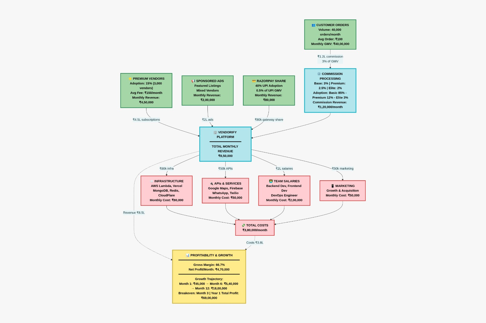
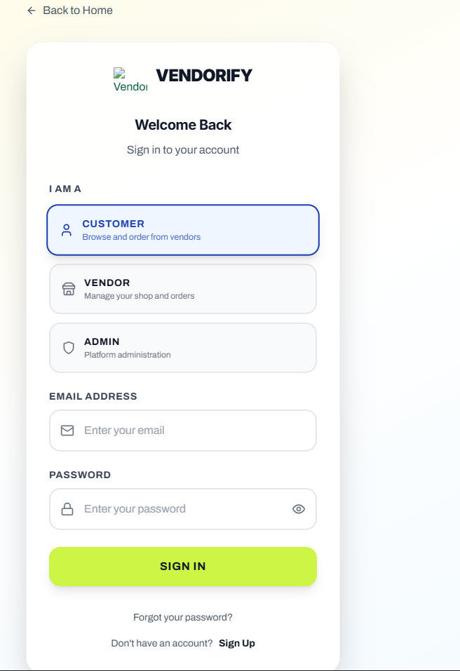
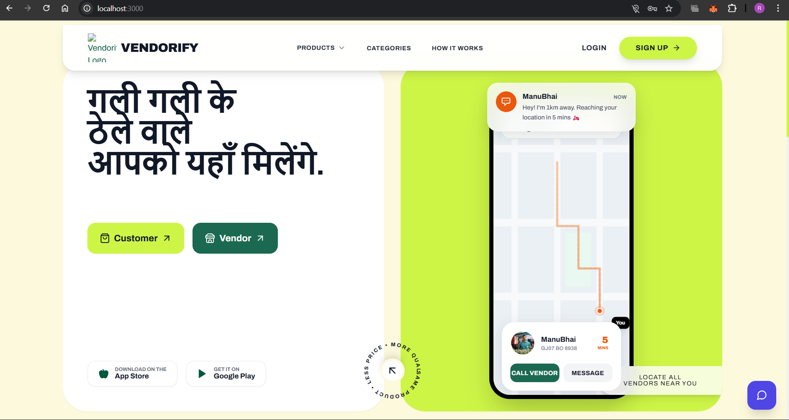
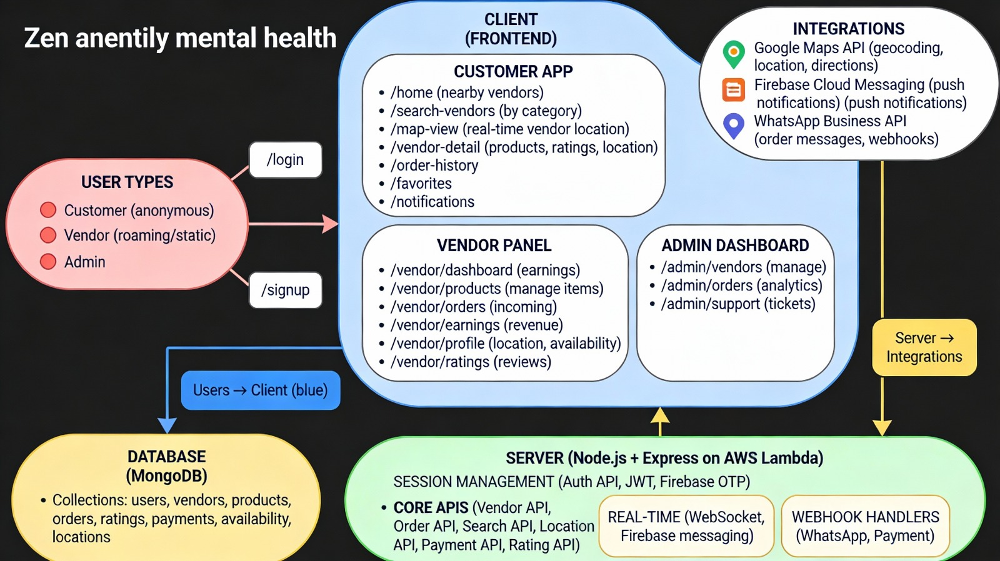
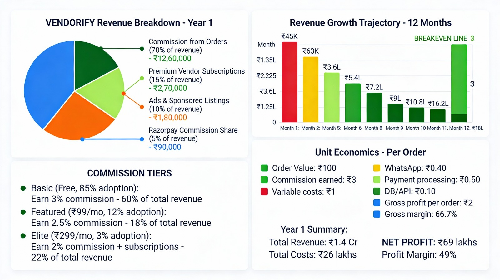
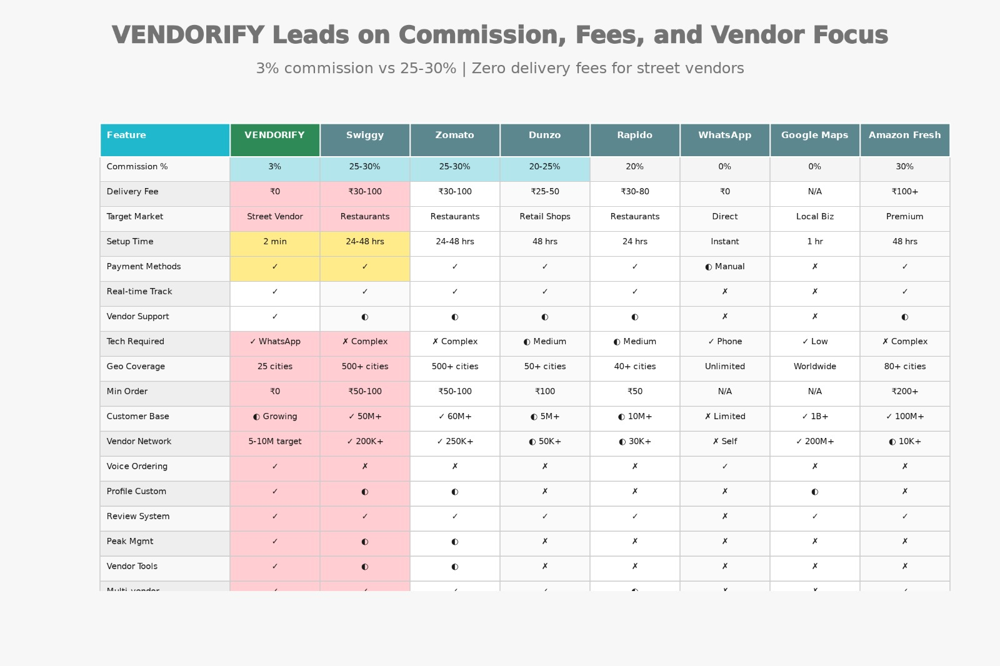

# Vendorify  
### Hyperlocal Vendor Discovery & Digital Presence Platform

> *“गली गली के ठेले वाले आपको यहाँ मिलेंगे.”*

Vendorify is a hyperlocal, WhatsApp-first discovery platform built to give **street vendors and local sellers** a digital presence, real-time visibility, and direct access to nearby customers.

---

## 📌 About the Project

Across Indian cities and towns, most street vendors still operate offline. Customers who want affordable, local food or services often can’t discover them digitally and are pushed toward expensive branded platforms.

Vendorify solves this problem by creating a **simple, vendor-first digital ecosystem** that works for both **static and roaming vendors**, without forcing them to learn complex apps.

---

## 🧩 Problem Statement

Street vendors face multiple challenges:
- No presence on Google Maps, Zomato, Swiggy, or ONDC
- Heavy dependence on foot traffic and physical visibility
- Difficulty being discovered when vendors are roaming
- Lack of centralized ordering, payment, and communication
- Customers unable to find affordable local options

This leads to income instability, digital exclusion, and lost opportunities.

---

## 💡 Our Solution

Vendorify provides:
- Easy vendor onboarding in under 2 minutes
- Real-time, map-based vendor discovery
- WhatsApp-first communication and ordering
- Live tracking of roaming vendors
- Low-commission, vendor-friendly revenue model

---

## 🖥️ Platform Preview


The landing page introduces the platform with a strong local-first message and clear entry points for customers and vendors.

---

## 🔐 Authentication & User Roles

Vendorify supports three user roles:

- **Customer** – Discover nearby vendors and place orders
- **Vendor** – Manage shop, location, orders, and earnings
- **Admin** – Monitor platform activity and manage vendors



---

## 📍 Vendor Discovery & Dashboard

Customers can:
- Discover vendors within a nearby radius
- Filter by categories (Street Food, Vegetables, Fruits, Tea, Services)
- View vendor status (Live / Available)
- Track roaming vendors in real time



---

## 🗂️ Vendor Categories

Vendorify supports multiple vendor types including:
- Street Food
- Fruits
- Vegetables
- Tea & Coffee
- Seasonal Vendors
- Home Repair & Local Services


---

## ⚙️ System Architecture (High Level)

Vendorify is built as a scalable, real-time system:

- Client (Web / Mobile)
- Backend APIs (Node.js & Express)
- Real-time updates (Socket.IO)
- Database (MongoDB + Redis)
- External integrations (Google Maps, Firebase, WhatsApp)



---

## 🛠️ Tech Stack

### Frontend
- React 18 + TypeScript
- Tailwind CSS
- Framer Motion
- Google Maps API

### Backend
- Node.js 18
- Express.js
- MongoDB + Mongoose
- Redis
- Firebase Authentication
- Socket.IO
- WhatsApp Business API

### AI Integration
- Gemini API
- Hugging Face Transformers
- Custom ML Models

---

## 💰 Revenue Model

Vendorify follows a **vendor-first monetization approach**:

- Small commission on orders
- Optional premium vendor subscriptions
- Sponsored listings and local ads
- Payment gateway commission sharing

This keeps costs affordable while ensuring platform sustainability.

---

## 🆚 Market Comparison

Compared to traditional delivery platforms:

- Much lower commission (2–3%)
- Supports roaming vendors
- WhatsApp-first interaction
- Faster onboarding
- Focus on local vendors instead of large restaurants

---

## 🏆 Hackathon Details

- **Hackathon:** PU Code Hackathon 3.0  
- **Track:** Web 2.0  
- **Team Name:** Code Impact  
- **Team Leader:** Vaishnav Reddy  
- **Institute:** PIET  

---

## 🚀 Future Scope

Planned enhancements include:
- Voice-based onboarding for vendors
- Multilingual support
- ONDC integration
- AI-based demand prediction
- Vendor credit scoring
- Municipal and government dashboards

---

## 🧪 Running the Project Locally

```bash
git clone https://github.com/vaishnav-reddy/Vendorify--CodeImpact-.git
cd vendorify
cd server
npm install
npm run dev
cd client
npm install
npm run dev